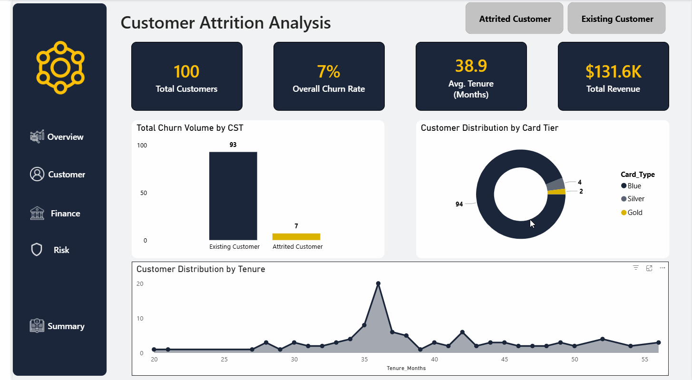
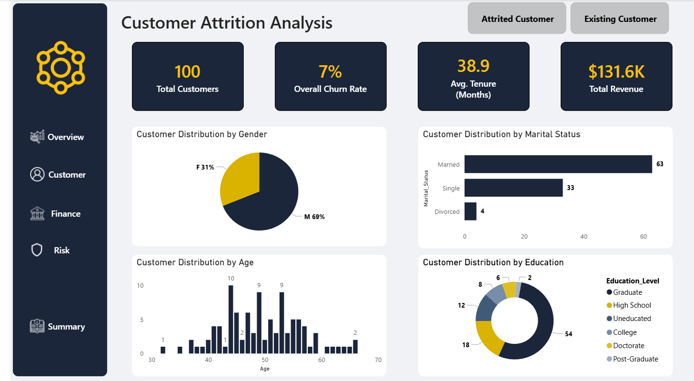
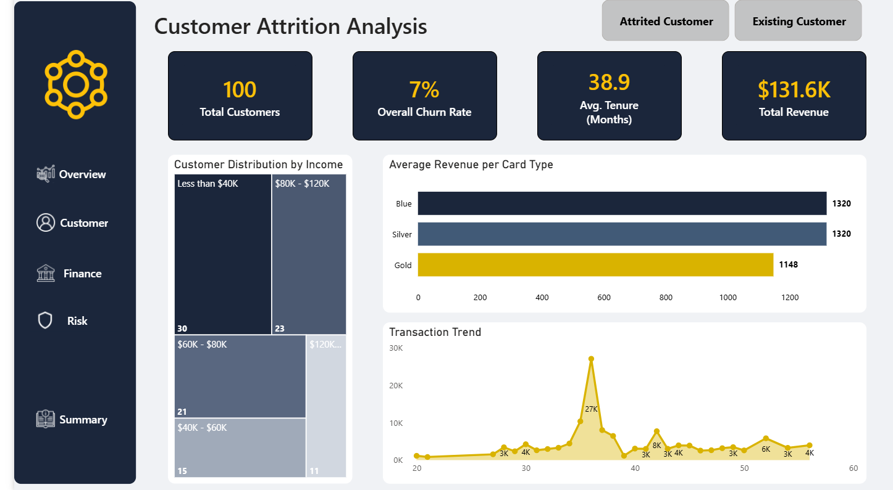
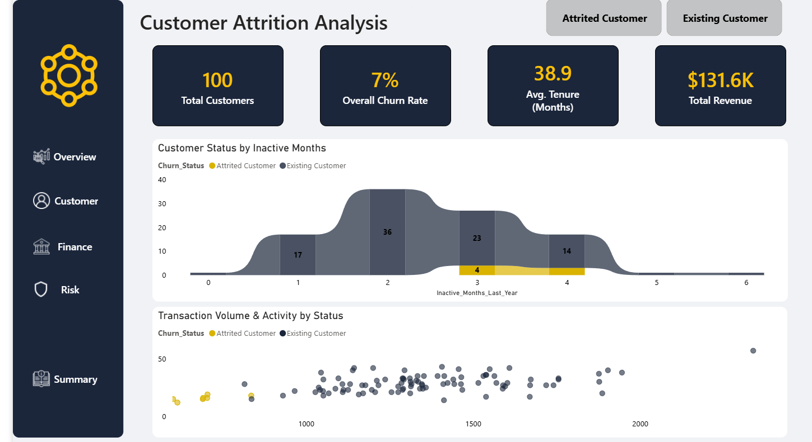
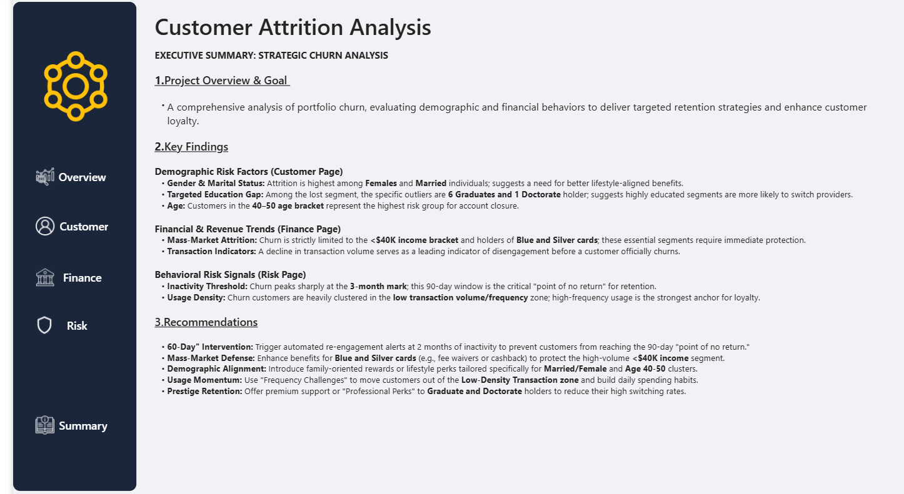

# Customer Attrition Analysis (Python · SQL · Power BI)

---

## 📊 Dashboard Preview

---

## 🎯 Project Overview

A comprehensive end-to-end analysis of customer churn behavior 
for a banking portfolio of 10,127 customers. The goal was to 
identify the key demographic, financial, and behavioral drivers 
of attrition and deliver targeted retention strategies.

---

## 🔧 Step-by-Step Transformation

1. **Data Loading (Python):** Loaded 3 Excel sheets 
(Customer_Info, Account_Activity, Transaction_Credit) and 
merged them into a single DataFrame of 10,127 rows and 21 columns.
2. **Data Cleaning (Python):** Removed duplicates, fixed typos 
in Marital_Status, imputed missing values in Age, Education_Level, 
and Income_Range, and corrected data types.
3. **Analytical Queries (SQL):** Built 10 analytical views covering 
churn rate, income distribution, card types, transaction trends, 
inactivity patterns, and education profiles.
4. **Visualization (Power BI):** Built a 5-page interactive 
dashboard with a navigation sidebar, Attrited/Existing customer 
toggle, and an Executive Summary page.

---

## 💡 What the Data Told Me

- **Churn Rate:** 7% overall — concentrated in the 
**<$40K income** segment with Blue and Silver card holders.
- **Loyalty Peak:** Existing customers at **36 months tenure** 
generate the highest transaction volume (27K) — retention 
through the first 3 years is critical.
- **Inactivity Threshold:** Churn peaks sharply at the 
**3-month inactivity mark** — the critical point of no return.
- **Demographic Risk:** Highest attrition among **Female** and 
**Married** customers in the **40–50 age bracket.**
- **Education Signal:** Graduate and Doctorate holders show 
the highest switching rates despite being high-value segments.

---

## 🖥️ Dashboard Pages

### 1. Overview

### 2. Customer

### 3. Finance

### 4. Risk

### 5. Executive Summary

---

## 🛠️ Tools Used

| Tool | Purpose |
|---|---|
| Python (Pandas) | Data loading, merging & cleaning |
| SQL (T-SQL) | Analytical views & queries |
| Power BI | Dashboard design & visualization |
| Google Colab | Python development environment |
| GitHub | Project hosting & documentation |

---

## 📂 Project Files

| File | Description |
|---|---|
| `customer_attrition_data_cleaning.ipynb` | Python data cleaning notebook |
| `customer_attrition_schema.sql` | Database schema |
| `customer_attrition_analysis_queries.sql` | 10 analytical SQL views |
| `Customer-Attrition-Analysis.pbix` | Power BI dashboard file |

---

## 📬 Contact

- **Name:** Assem Mohamed
- **GitHub:** [assemmohamed662-gif](https://github.com/assemmohamed662-gif)
- **LinkedIn:** [Assem Hasanen](https://www.linkedin.com/in/assem-hasanen)
